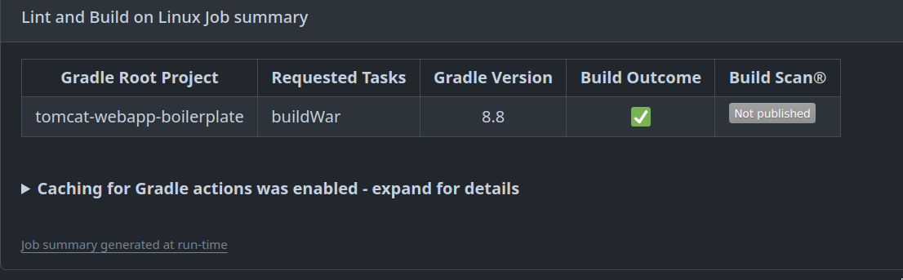

# Tomcat Webapp Boilerplate

<!--toc:start-->

- [Tomcat Webapp Boilerplate](#tomcat-webapp-boilerplate)
  - [Features](#features)
  - [Basics](#basics)
    - [Development](#development)
    - [Git Hooks](#git-hooks)
    - [Github Actions](#github-actions)
    - [Release](#release)
    - [Static code analyzers](#static-code-analyzers)
    - [Dynamic Application Security Testing (DAST)](#dynamic-application-security-testing-dast)
    - [Sarif Reports](#sarif-reports)
    - [Auto upload images](#auto-upload-images)
  - [Env vars needed in github secrets](#env-vars-needed-in-github-secrets)
  - [Additional Tools and references](#additional-tools-and-references)
    - [References](#references)
    - [Alternatives/Additions](#alternativesadditions)
      - [Considered Strongest, but paid](#considered-strongest-but-paid)
      - [others](#others)
      - [Free](#free)
      - [Other static analysis tools](#other-static-analysis-tools)
- [Find out more](#find-out-more)
- [Github actions interesting links](#github-actions-interesting-links)
  - [Artifacts](#artifacts)
  - [Expressions](#expressions)
  - [Summaries](#summaries)
  <!--toc:end-->

Proof of concept for a tomcat webapp boilerplate with automated testing and security checks.

Many features are ported from <https://github.com/gipo999/smispi>, please refer to that repository for additional notes and documentation. _Additional feats from that repo like pitest can be added to this one._

## Features

- gradle tasks,
- docker standalone image with tomcat,
- docker-compose for development,
- pre, post commit, pre push git hooks to protect from secrets exposure and other issues,
- github actions (health, security, static code analysis and Dynamic Application Security Testing (DAST), release, publish),
- code coverage with codecov
- semantic-release: more info on [Release](#release)

## Basics

### Development

- Live environment with a `tomcat` docker image
- Auto-restart on code change with `npm run dev` utilizing docker-compose and nodemon
  - check [docker-compose.yml](./compose.dev.yml) for more info
- Linting with `npm run lint` (runs buildWar)
- Fixing linting issues with `npm run fix` (runs spotless and rewrite)

### Git Hooks

- pre-commit
- post-commit
- pre-push

### Github Actions

Must be buildable and pass all checks with `gradlew buildWar`

Verifies the war is runnable with a health check http request on the container.

Vulnerability assessment actions:

- sonarqube/sonarcloud _(provides insights at <https://sonarcloud.io/summary/new_code?id=gipo999_tomcat-webapp-boilerplate>)_
- snyk _(provides insights at <https://app.snyk.io/org/gipo355>)_
- codeql
- semgrep _(provides WEB UI for results insights at <https://semgrep.dev/manage>)_
- dependency review
- Custom made nmap action <https://github.com/gipo355/docker-vuln-scanners-nmap-action>
  - this utilises a custom made cli tool in a docker container with cobra and go @ <https://github.com/gipo355/docker-vuln-scanners>
  - WARN: this action is deactivated as it scans the whole github host runner giving insights on possible vulnerabilities
- Custom made wapiti action <https://github.com/gipo355/docker-vuln-scanners-wapiti-action>
  - this utilises a custom made docker image (gipo355/wapiti) with wapiti installed
  - can be customized and improved. <https://github.com/wapiti-scanner/wapiti/blob/master/doc/wapiti.ronn>
- OWASP ZAP (Zed Attack Proxy)
  - using the base full-scan option
  - can use the API scan instead (<https://www.zaproxy.org/docs/docker/api-scan/>, <https://github.com/zaproxy/action-api-scan>) can be fed and openapi spec
  - can be customized and improved. Can be put in a custom action to get the full cli power and adding extensions/addons (like sarif report <https://www.zaproxy.org/docs/desktop/addons/report-generation/report-sarif-json/>)

Reports that won't generate a sarif are uploaded to github pages or are made available with custom actions at [issues](https://github.com/gipo999/tomcat-webapp-boilerplate/issues)
_note issues, pr comments, gh pages are considered vulnerabilities since they expose information_

Please check [gh pages](https://gipo999.github.io/tomcat-webapp-boilerplate/)

Read more at [Sarif Reports](#sarif-reports)

### Release

- Automatic release with `semantic-release` and `commitizen`

Uses commitizen for commit messages and automatically creates github tags+releases adding the WAR, javadoc and source code to the release at that point in time

Please check [releases](https://github.com/gipo999/tomcat-webapp-boilerplate/releases)

- automatic image publishing to dockerhub and github packages

Requires commits to be made following the `commitizen` format

- Fix: bump patch version
- Feat: bump minor version
- BREAKING CHANGE: bump major version

### Static code analyzers

- semgrep
- sonarqube
- codeql
- dependency review
- dependabot security alerts
- snyk open source
- snyk container
- snyk code

### Dynamic Application Security Testing (DAST)

- OWASP ZAP (Zed Attack Proxy)
- nmap
- load tester with wrk
- wapiti
- others can be added with custom actions or adding to the nmap cli tool created

Please check [Alternative/Additions](#alternativesadditions)

### Sarif Reports

Sarif reports can be uploaded to github with the `upload-sarif` action.

They provide a standard format for static analysis tools, and can be used in github security tab
to have a better overview of the vulnerabilities and identify the tools that generated them.

Requires custom actions to parse bugged or missing sarif reports (zap, nmap, wapiti, snyk container).

Please check [attack action](./.github/actions/attack/action.yml) for more info

### Auto upload images

After a succesful release, the docker image is uploaded to dockerhub and github packages with tags `latest`, `vX.Y.Z` and `sha`

- [dockerhub](https://hub.docker.com/r/gipo999/tomcat-webapp-boilerplate)
- [github packages](https://hub.docker.com/r/gipo999/tomcat-webapp-boilerplate)

## Env vars needed in github secrets

- `SEMGREP_APP_TOKEN`
- `DOCKERHUB_TOKEN`
- `DOCKERHUB_USERNAME`
- `SNYK_TOKEN`
- `PAT`
- `CODECOV_TOKEN`

## Additional Tools and references

### References

<https://owasp.org/www-community/Free_for_Open_Source_Application_Security_Tools>

### Alternatives/Additions

#### Considered Strongest, but paid

- nessus <https://medium.com/@ben.swain_70016/attack-surface-monitoring-github-actions-nessus-3e3e83d44a34>

- acunetix

- burpsuite

- purpleteam

#### others

- astra <https://www.getastra.com/pentest/pricing>

- apiscan <https://www.apisec.ai/>

- pentest tools <https://pentest-tools.com/pricing>

- portswigger <https://portswigger.net/burp/vulnerability-scanner/api-security-testing>

<https://owasp.org/www-community/api_security_tools>

<https://nordicapis.com/api-vulnerability-scanners/>

<https://github.com/arainho/awesome-api-security>

<https://github.com/sbilly/awesome-security>

<https://github.com/okhosting/awesome-cyber-security>

#### Free

- nuclei

- flan <https://github.com/cloudflare/flan>

- trivy

<https://github.com/topics/vulnerability-assessment>

#### Other static analysis tools

<https://github.com/eclipse/steady>

# Find out more

Check more notes/todos @ [github project](https://github.com/users/gipo999/projects/3/views/1), [issues](https://github.com/gipo999/tomcat-webapp-boilerplate/issues)

You can take a look at other branches (.bak, etc) for older versions or different approaches.

Every file has comments with implementation details

# Github actions interesting links

## Artifacts

<https://github.com/actions/upload-artifact>

## Expressions

<https://docs.github.com/en/actions/learn-github-actions/expressions>

## Summaries

<https://github.blog/2022-05-09-supercharging-github-actions-with-job-summaries/>

